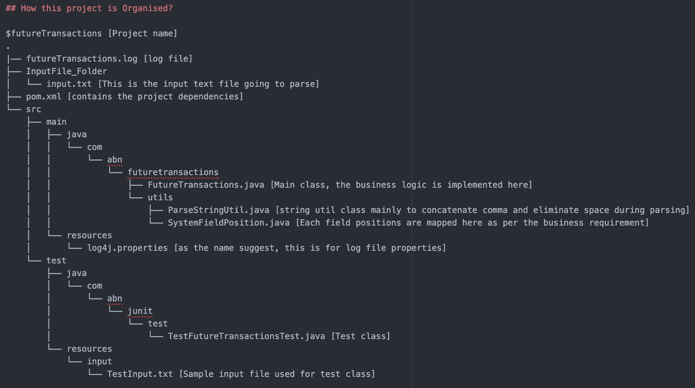

# futureTransactions
Parse an input file and create an output.csv file based on business rules

This is a simple maven based java application.

## Scope of this application?
1. The java application parse an input text (.txt) file from futureTransactions/Input_Folder directory.
2. Read the input text file and generate a output.csv file in the futureTransactions/OutputFile_Folder directory
3. Application activities can be monitored from the generated log file (futureTransactions/futureTransactions.log)

## What is the minimum requirement to run this application?
1. JDK1.8 (minimum)
2. Any command line application (CMD/ power shell/ terminal (for Mac))

### Which Operating systems are supported?
Windows 64/ Linux / Mac OS

## What are the steps to execute the application?
1. Unzip futureTransactions.zip file.
2. $ cd futureTransactions
2. In command line application / or Terminal run the following commands:

  a. $ mvn clean install
    - This command will download the required dependencies and build and run the test cases.

  b. $ mvn exec:java -Dexec.mainClass="com.abn.futuretransactions.FutureTransactions"
    - This command will run the application and generate output.csv file in futureTransactions/OutputFile_Folder directory

## How this project is Organised?

## Troubleshooting
Tested on both windows and mac machines and it worked out of the box. So make sure to configure the JDK path correctly to before running the mvn commands.
